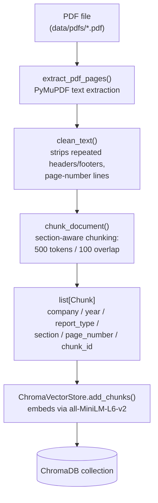
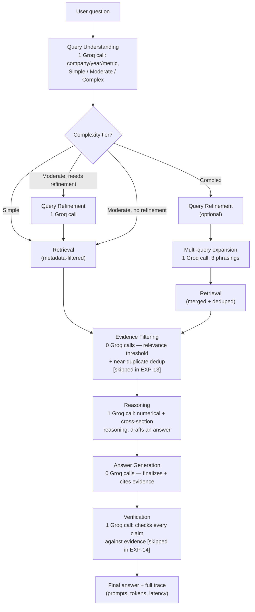

# FinAgent-RAG

**Adaptive Multi-Agent Retrieval-Augmented Generation for Financial Document Intelligence**

Master's thesis implementation (Machine Learning & AI, Liverpool John Moores University) by
**Kasi Viswanadh Maddala**, supervised by Shubham Gupta. This repository is the implementation
workspace only — it builds, tests, and benchmarks the FinAgent-RAG system described below against
[FinanceBench](https://github.com/patronus-ai/financebench), a real-filings financial QA dataset.

## The problem

Financial filings (10-K, 10-Q, 8-K, earnings reports) mix structured tables with unstructured
narrative, and the evidence needed to answer a question is often fragmented across sections,
footnotes, and cross-references. A fixed-pipeline RAG system — one retrieval strategy, one prompt,
regardless of the question — struggles with ambiguous, multi-step, or multi-section queries.

This project builds an **adaptive multi-agent RAG pipeline** that routes each question through a
different amount of reasoning depending on its complexity, and benchmarks it against five
progressively more capable baselines plus three ablations — fourteen experiments total, all under
one controlled setup (same dataset, embedding model, LLM, and metrics) — to determine where
adaptive/agentic reasoning actually earns its extra cost, and where it doesn't.

## Architecture

### The seven agents

| Agent | Role |
|---|---|
| Query Understanding | Detects intent, company, reporting period, terminology, and complexity level |
| Query Refinement | Rewrites ambiguous/broad questions into retrieval-friendly form |
| Retrieval | Semantic + metadata search over the ChromaDB knowledge base |
| Evidence Filtering | Removes redundant/weak/noisy chunks |
| Reasoning | Numerical interpretation and cross-section reasoning |
| Answer Generation | Produces the final grounded natural-language response |
| Verification | Validates the answer is actually supported by the retrieved evidence |

Routing is based on cheap, deterministic signals (number of companies/years/metrics referenced,
question type, whether calculation or multi-chunk evidence is needed) that can only **escalate**
complexity, never downgrade it — a simple lookup takes a 3-call short path straight to Reasoning; a
complex, explanation-oriented question triggers query refinement, multi-query expansion, evidence
filtering, and verification on top.

### Document processing (offline, once per PDF)



### Query time: the adaptive multi-agent system (EXP-11..14)



Full diagrams for every one of the 14 experiments (including the fixed RAG baselines EXP-07..10 and
the six Direct LLM prompting variants EXP-01..06) and the evaluation pipeline are in
[`docs/ARCHITECTURE_FLOW.md`](docs/ARCHITECTURE_FLOW.md). A plain-language description of every
function in the codebase is in [`docs/FUNCTION_GUIDE.md`](docs/FUNCTION_GUIDE.md).

## The 14-experiment benchmarking ladder

| # | Experiment | Category |
|---|---|---|
| EXP-01..06 | Direct LLM — zero-shot / role-based / few-shot / stepwise / self-verification / structured-output prompting | Direct LLM baselines |
| EXP-07 | Naïve RAG (ChromaDB) | Basic RAG |
| EXP-08 | Metadata-Aware RAG | Improved RAG |
| EXP-09 | Query-Rewritten RAG | Query reformulation |
| EXP-10 | Multi-Query RAG | Multi-query |
| EXP-11 | **Adaptive Multi-Agent RAG** | Proposed system |
| EXP-12 | Adaptive system, no Query Refinement | Ablation |
| EXP-13 | Adaptive system, no Evidence Filtering | Ablation |
| EXP-14 | Adaptive system, no Verification | Ablation |

**Fixed across all 14** so any performance difference is attributable to architecture alone:
FinanceBench (same PDF collection), Groq `llama-3.3-70b-versatile` at temperature 0.0, ChromaDB
with `all-MiniLM-L6-v2` embeddings, 500-token chunks with 100-token overlap, top-5 retrieval.

## Evaluation

Every experiment is scored on the same five metric families — computed entirely offline (zero
additional Groq calls) via embeddings, string comparison, and cross-referencing FinanceBench's own
labeled evidence pages:

- **Answer Quality** — relevance, exact match, F1, semantic similarity
- **Evidence & Retrieval** — context recall/precision, Hit@K, MRR
- **Grounding & Trust** — faithfulness, hallucination rate, evidence coverage, citation correctness
- **Financial Reasoning** — numerical/calculation accuracy, multi-step reasoning score, explanation completeness
- **Efficiency** — latency, token usage, cost per answer

## Project layout

```
src/finagent/
  document_processing/   PDF extraction, cleaning, section detection, table extraction, chunking, ChromaDB
  data/                   FinanceBench loading and schemas
  llm/                    Groq client + multi-key rate-limit pool
  agents/                 The 7 agents
  metrics/                The 5 metric families
  experiments/            The 14 experiment runners, registry, and stratified sampling
  results/                Results workbook writer
  logging_config.py
src/tests/                pytest suite (mirrors the src/finagent/ layout)
scripts/                  run_pilot.py, export_pilot_results.py, generate_call_budget.py
docs/                     ARCHITECTURE_FLOW.md, FUNCTION_GUIDE.md
data/                     FinanceBench JSONL + baseline results (PDFs are gitignored — see Setup)
```

## Setup

```bash
python -m venv .venv
source .venv/bin/activate            # Windows: .venv\Scripts\activate
pip install -r requirements.txt

cp .env.example .env                 # then fill in GROQ_API_KEYS (comma-separated, supports 1+ keys)
```

Download the FinanceBench PDFs into `data/pdfs/` (not tracked in this repo — see
[patronus-ai/financebench](https://github.com/patronus-ai/financebench/tree/main/pdfs)).

Run the test suite (no Groq calls, fully mocked):

```bash
PYTHONPATH=src python -m pytest src/tests -q
```

Run the pilot (a stratified sub-sample across all 14 experiments, live Groq calls):

```bash
PYTHONPATH=src python scripts/run_pilot.py
```

## Status

The pipeline is implemented and validated end-to-end — all 7 agents, all 14 experiments, the full
metric suite, and PDF processing have been checked per-company across the entire FinanceBench
document set. A live pilot run across all 14 experiments surfaced and fixed a real evidence-matching
bug (FinanceBench's labeled page numbers don't always align with raw PDF page indices) and an
ongoing investigation into unfiltered-retrieval quality once the corpus spans many companies. See
[`VALIDATION.md`](VALIDATION.md) for the full validation log and pilot findings.

The full 150-question run across all 14 experiments is gated on Groq free-tier daily token budget,
paced across multiple keys/days rather than a single run.

## Dataset

[FinanceBench](https://github.com/patronus-ai/financebench) — 150 open-source question/answer pairs
with evidence annotations over 368 real financial filings (10-K, 10-Q, 8-K, earnings reports),
evaluable at document/page/chunk level.
