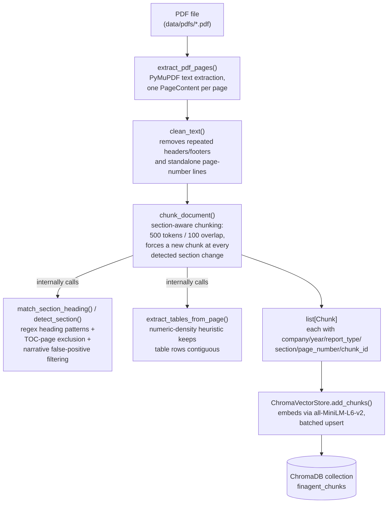
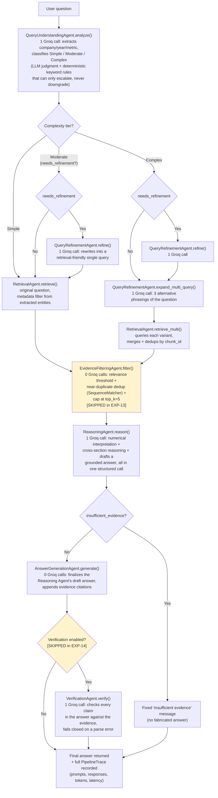
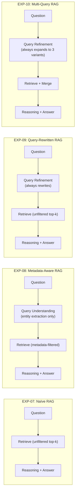
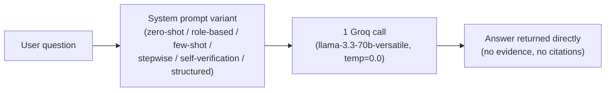
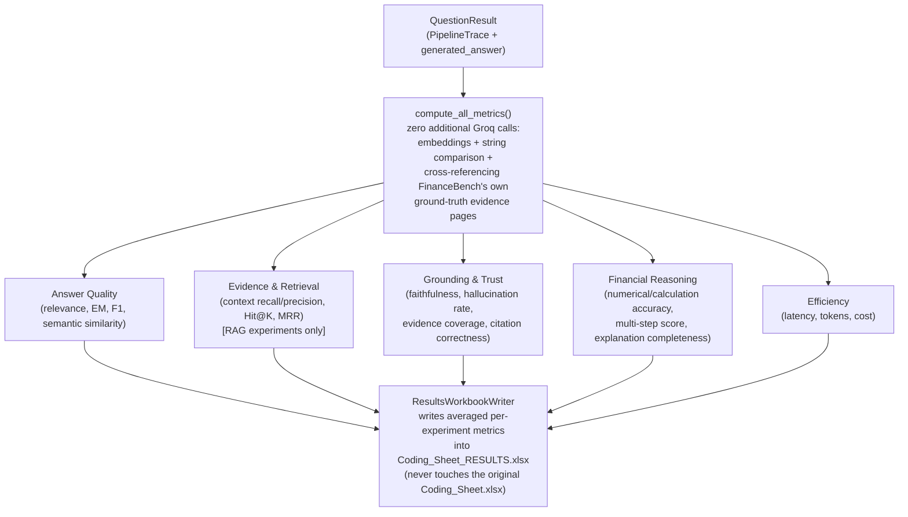

# FinAgent-RAG: End-to-End Technical Flow

This document shows every stage the system goes through, from a raw PDF on disk to a final
verified answer. It reflects what is actually implemented in `src/finagent/`, not just the
proposal's description — see `.claude/skills/finagent-architecture/SKILL.md` for the design
rationale behind each stage, and `docs/FUNCTION_GUIDE.md` for a plain-language walkthrough of
every function shown here.

## 1. Document Processing Pipeline (offline, one-time per PDF)

Runs once per PDF to populate the shared ChromaDB knowledge base. Every RAG experiment (EXP-07
through EXP-14) reads from this same store; it is never rebuilt per-experiment.

## 2. Query-Time Pipeline: the Adaptive Multi-Agent System (EXP-11..14)

This is the proposed system (EXP-11) and its three ablations (EXP-12/13/14, each disabling exactly
one stage). Every box after "Query Understanding" is conditional on the routing decision — a
Simple question skips straight to Reasoning.

**Groq call count by route** (validated by the mocked-client test suite, `src/tests/experiments/test_registry.py`):

| Route | Calls | Which agents |
|---|---|---|
| Simple | 3 | Query Understanding, Reasoning, Verification |
| Moderate, no refinement needed | 3 | same as Simple |
| Moderate, refinement needed | 4 | + Query Refinement (refine) |
| Complex, no refinement needed | 4 | Query Understanding, Multi-Query, Reasoning, Verification |
| Complex, refinement needed | 5 | + Query Refinement (refine) before Multi-Query |

EXP-12 (no Query Refinement) forces every route to behave like the Simple row (3 calls, always).
EXP-13 (no Evidence Filtering) has identical call counts to EXP-11 — the ablation shows up in
*which* chunks reach Reasoning, not in call count, since filtering is free. EXP-14 (no
Verification) is always exactly 1 call fewer than the equivalent EXP-11 row.

## 3. The Simpler RAG Pipelines (EXP-07..10)

Each is a fixed (non-adaptive) point on the same spectrum — no complexity routing at all.

None of EXP-07..10 use Evidence Filtering or Verification — evidence goes straight from retrieval
to Reasoning, and the Reasoning Agent's draft answer is returned as-is.

## 4. The Direct LLM Baselines (EXP-01..06)

No retrieval, no ChromaDB, no agents at all — one Groq call per question, differing only in the
system prompt (`experiments/direct_llm_prompts.py`).

## 5. Evaluation — What Happens After an Answer Is Produced

Every experiment, regardless of which pipeline above produced the answer, funnels into the same
metric computation and results-recording path:

